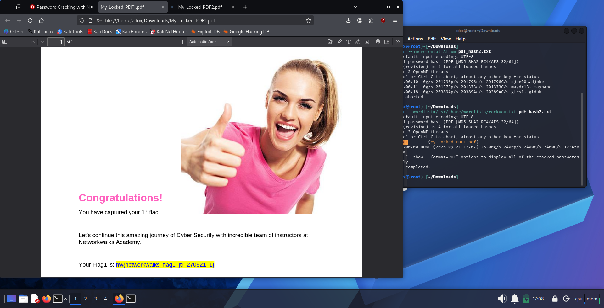
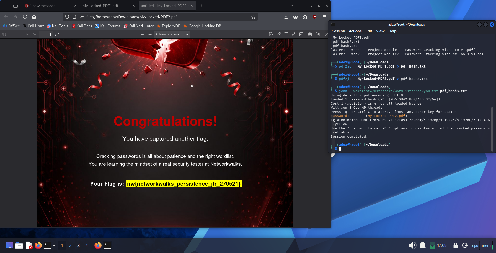
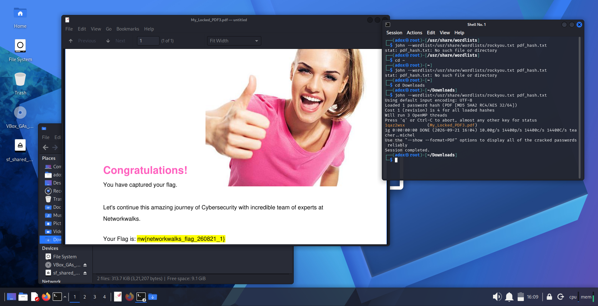
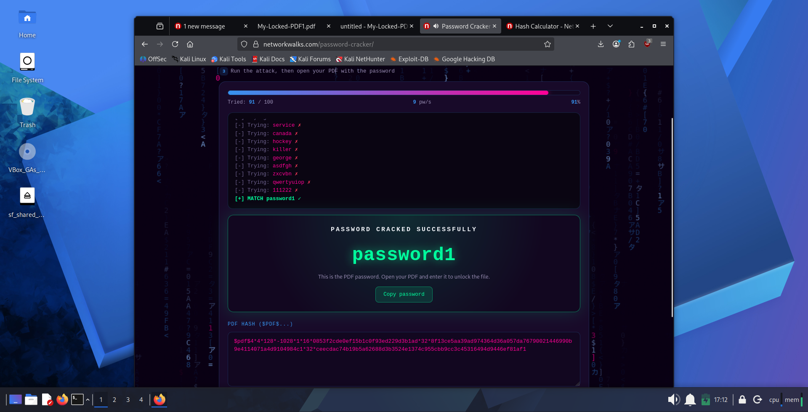
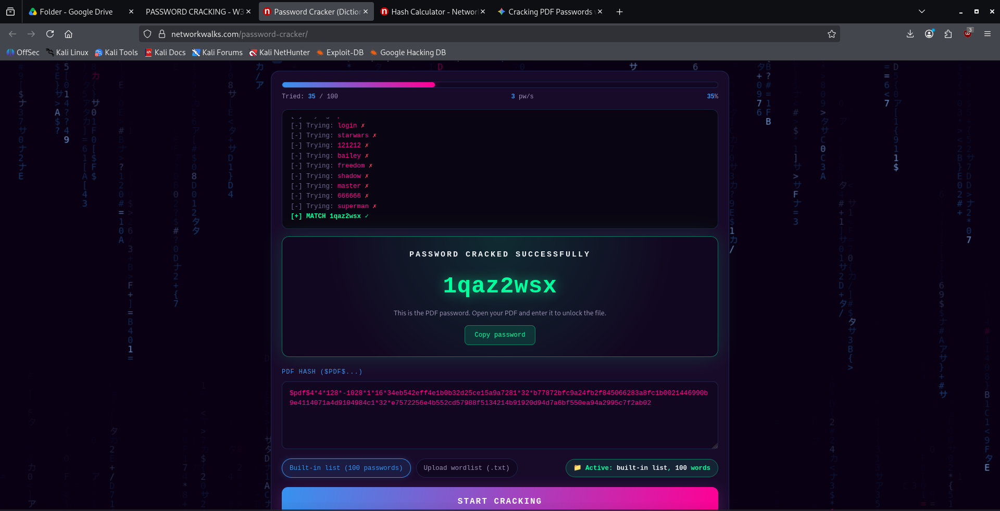

<div align="center">

# Week 3 — PDF Password Cracking & Password Security Assessment

</div>

<p align="center">
  
  
  
  
  
  
  
  
  
  
  
  
  
</p>

**Name:** Aawishko De  
**Program / Batch:** B083 – Networkwalks  
**Week:** 03  
**Focus:** PDF Password Recovery, Hash Extraction & Wordlist-Based Attacks  
**Environment:** Kali Linux (VirtualBox) 

---

## Overview

During Week 3 of my Cybersecurity Internship at Networkwalks, I performed a practical exercise focused on **PDF password security and password recovery** in a controlled laboratory environment.

The practical involved extracting password-hash information from protected PDF files, performing a dictionary-based password attack using **John the Ripper**, and verifying the recovered passwords against the original PDF files.

I also repeated the exercise using Networkwalks' online hash extraction and password-cracking tools to compare the local Kali Linux workflow with a simplified web-based approach.

---

## Objectives

The main objectives of this practical were to:

- Understand how password-protected PDF files can be analyzed.
- Extract PDF password hashes using `pdf2john`.
- Understand the role of password hashes in password-cracking workflows.
- Perform a wordlist-based password attack using John the Ripper.
- Use the Kali Linux `rockyou.txt` wordlist.
- Verify recovered passwords against the original protected PDFs.
- Compare a local command-line workflow with an online password-cracking workflow.
- Understand the security implications of weak and predictable passwords.

---

## Tools & Technologies

| Tool | Purpose |
|---|---|
| **Kali Linux** | Security testing and laboratory environment |
| **pdf2john** | Extract PDF password-hash information |
| **John the Ripper** | Password recovery using dictionary/wordlist attacks |
| **rockyou.txt** | Password wordlist used for candidate generation |
| **Networkwalks Online Hash Extractor** | Online PDF hash extraction |
| **Networkwalks Online Password Cracker** | Online password recovery |
| **Firefox** | Accessing the Networkwalks online tools and verifying PDFs |

---

## Practical Workflow

The overall workflow followed during the laboratory was:

```text
Protected PDF
     │
     ▼
  pdf2john
     │
     ▼
Extracted PDF Hash
     │
     ▼
John the Ripper
     │
     ▼
rockyou.txt Wordlist
     │
     ▼
Password Match
     │
     ▼
Password Verification
````

---

## 1. PDF Hash Extraction

The practical began by extracting the password-hash information from the protected PDF files.

For example:

```bash
pdf2john My-Locked-PDF1.pdf > pdf_hash.txt
```

The extracted hash was stored in a text file so that it could be processed by John the Ripper.

The same process was performed for the other assigned PDF files.

Example:

```bash
pdf2john My-Locked-PDF2.pdf > pdf_hash3.txt
```

This demonstrated the separation between **hash extraction** and **password recovery**.

---

## 2. Password Cracking with John the Ripper

After extracting the hashes, John the Ripper was used with the Kali Linux `rockyou.txt` wordlist.

Example command:

```bash
john --wordlist=/usr/share/wordlists/rockyou.txt pdf_hash.txt
```

John the Ripper loaded the PDF hash and tested candidate passwords from the wordlist.

The recovered passwords were then verified by opening the corresponding protected PDF files.

This provided confirmation that the recovered passwords were valid rather than simply being reported as matches by the cracking tool.

---

## 3. Password Recovery for Multiple PDFs

The same methodology was repeated against all three assigned laboratory PDFs.

For each PDF:

1. Extract the hash using `pdf2john`.
2. Store the extracted hash.
3. Run John the Ripper against the hash.
4. Use the `rockyou.txt` wordlist.
5. Recover the matching password.
6. Open the original PDF using the recovered password.
7. Confirm successful access.

### Result

All three assigned PDF passwords were successfully recovered and verified.

> **3/3 PDF password recovery attempts were successful.**

The individual recovered passwords and detailed evidence are documented in the accompanying practical report.

---

## 4. Online Password-Cracking Workflow

After completing the Kali Linux workflow, I performed the same general exercise using the Networkwalks online tools.

The online workflow consisted of:

```text
PDF
 │
 ▼
Online Hash Extraction
 │
 ▼
PDF Hash
 │
 ▼
Online Password Cracker
 │
 ▼
Password Match
 │
 ▼
PDF Verification
```

The online interface provided a faster and more simplified workflow compared with manually extracting the hashes and configuring John the Ripper from the Kali terminal.

This comparison helped demonstrate that the underlying password-recovery concept remains the same even when the user interface and execution environment differ.

---

## Key Learning Outcomes

Through this practical, I gained hands-on experience with:

* PDF password-protection mechanisms.
* Password-hash extraction.
* `pdf2john`.
* John the Ripper.
* Dictionary-based password attacks.
* Wordlist usage.
* The Kali Linux `rockyou.txt` wordlist.
* Password verification.
* Command-line cybersecurity workflows.
* Online password-cracking tools.
* The security implications of predictable passwords.

One important observation from the exercise was that passwords appearing in commonly available wordlists can potentially be recovered efficiently through dictionary-based attacks.

---

## Security Recommendations

Based on the practical,the following measures can help reduce exposure to dictionary-based password attacks:

* Use long and unpredictable passwords or passphrases.
* Avoid common words and predictable password patterns.
* Avoid password reuse across different systems and documents.
* Do not use passwords that are likely to appear in public password wordlists.
* Use appropriate modern encryption mechanisms for sensitive documents.
* Protect document passwords through secure communication channels.
* Periodically review the security of sensitive protected files.
* Conduct password-security testing only within an authorized scope.

---

## Evidence

The practical evidence includes screenshots showing:

* PDF hash extraction using `pdf2john`.
* John the Ripper execution in Kali Linux.
* Wordlist-based password recovery.
* Successful password matches.
* Verification of the recovered passwords by opening the protected PDFs.
* Networkwalks online password-cracking results.
* Successful completion of the laboratory exercises.

---

## Ethical & Authorization Notice

This practical was performed as part of an authorized cybersecurity training exercise.

The techniques documented in this repository should only be used against files, systems, or environments that are personally owned or where explicit authorization has been provided.

Unauthorized password cracking or access attempts may violate organizational policies and applicable laws.

---

## Conclusion

Week 3 provided practical experience with the complete workflow of a controlled PDF password-recovery exercise.

Starting from password-hash extraction with `pdf2john`, I used John the Ripper and the `rockyou.txt` wordlist to recover the passwords for all three assigned PDFs. I then verified the results by successfully opening the protected files.

The same general process was also performed using Networkwalks' online tools, providing a useful comparison between a command-line cybersecurity workflow and a simplified web-based implementation.

This exercise strengthened my understanding of **password security, hash extraction, wordlist attacks, John the Ripper, and practical security testing methodology**.

### Evidences Attached Below:






---

### Week 3 Completed

**Cybersecurity Internship — Networkwalks**
**Aawishko De | B083**
