<div align="center">

# Week 4 — Black-Box Penetration Testing & Web Security Assessment 

</div>

<p align="center">
  
  
  
  
  
  
  
  
  
  
  
  
  
  
  
</p>


**Name:** Aawishko De  
**Program / Batch:** B083 – Networkwalks  
**Week:** 04  
**Focus:** Web Penetration Testing, SQL Injection, Endpoint Reconnaissance (`robots.txt`), PDF Password Security & Critical Database Extraction  
**Environment:** Kali Linux / Web Browser / Zenmap / John the Ripper / Networkwalks Online Cracker  
**Target:** `https://medirozahospital.com`  

---

## Overview

During Week 4 of the **Networkwalks Cybersecurity Internship**, I performed a 5-day full **black-box penetration test** against **Mediroza General Hospital** (`https://medirozahospital.com`). 

The primary objective was to evaluate the security posture of the client's web infrastructure, exploit identified authentication vulnerabilities, test PDF document password strength, and uncover exposed server backup assets. The engagement was executed across four structured project milestones, resulting in full compromise of the patient portal, decryption of all protected patient laboratory reports, and discovery of an unencrypted database backup containing sensitive hospital operational, financial, and shareholder data.

---

## Objectives

The core deliverables and technical goals for this engagement included:

- **Network Reconnaissance:** Perform domain topology mapping and service discovery on `medirozahospital.com` .
- **Web Exploitation:** Identify and exploit authentication bypass vulnerabilities on the patient portal to retrieve confidential patient reports .
- **PDF Password Cracking:** Extract hashes from protected PDF laboratory files and recover passwords using dictionary and symbol mask attacks.
- **Endpoint Reconnaissance:** Analyze `/robots.txt` to discover unlinked web directories and test for directory indexing vulnerabilities.
- **Database Asset Extraction:** Extract internal employee compensation figures and hospital shareholder ownership details from exposed backup dumps .
- **Reporting &amp; Remediation:** Document findings, assign risk ratings (CVSS/Severity), and provide actionable remediation guidelines.

---

## Tools & Technologies

| Tool | Category | Engagement Purpose |
| :--- | :--- | :--- |
| **Kali Linux** | Security OS | Primary testing platform and command-line execution environment  |
| **Zenmap (Nmap)** | Reconnaissance | Domain mapping, topology scanning (`-sV`, `-p 53`), and port discovery  |
| **Firefox Browser** | Web Client | Application testing, SQL Injection payload delivery, and directory inspection  |
| **SQL Injection (SQLi)** | Web Exploitation | Bypassing authentication controls on `/patient/login.php` |
| **`pdf2john`** | Hash Extraction | Converting PDF encryption parameters into crackable hash signatures  |
| **John the Ripper (JtR)** | Password Recovery | Local hash cracking using dictionary and special character mask attacks |
| **`rockyou.txt`** | Wordlist | Standard dictionary wordlist for password candidate matching  |
| **Networkwalks Online Tools** | Web Utilities | Web-based hash extraction and online dictionary cracking verification |

---

## Engagement Workflow

```text
               Target Domain (medirozahospital.com)
                                │
        ┌───────────────────────┴───────────────────────┐
        ▼                                               ▼
[M1: Initial Access]                         [M3: Endpoint Recon]
 Zenmap Reconnaissance                        Inspect /robots.txt
        │                                               │
 SQLi (admin'--) on /patient/login.php         Discovered /old/ Directory
        │                                               │
 Download Encrypted PDFs                             Found mediroza_db_backup_2019.sql
        │                                               │
        ▼                                               ▼
[M2: Data Extraction]                        Extracted Staff    
                                                Salaries &
 Extract Hashes (pdf2john)/Networkwalks 
 password cracker                                 Shareholder Equity 
                                                  Holdings
        │
 Crack Passwords (JtR & Mask Attack)
        │
 Decrypt Patient Lab Findings
        │
        └───────────────────────┬───────────────────────┘
                                ▼
                   [M4: Penetration Test Report]

```

---

## Detailed Findings & Milestone Walkthrough

### 1. Milestone 1 (M1) — Network Reconnaissance & Initial Web Access

* *Network Reconnaissance:*
  
  * Executed Zenmap version and topology scans (`nmap -sV -p 53 medirozahospital.com` and `nmap -T4 -F 10.19.13.58`)[1][2].
  
  * Mapped host IP addresses (`199.188.201.16` / `10.19.13.58`) and confirmed open port `53/tcp` (domain service).

* **Authentication Bypass via SQL Injection:**
  
  * Navigated to the Patient Portal login endpoint at `https://medirozahospital.com/patient/login.php`.
  
  * Injected the SQL authentication bypass payload `admin'--` into the username input field.
  
  * Successfully bypassed authentication logic without valid credentials, gaining administrative/portal access to `/patient/portal.php`.

* **Retrieved Patient Records:**
  * Downloaded three password-encrypted patient laboratory reports:
    1. `Pathology Report - S. Dlamini` (Lab Ref: `LR-2024-1187`)
    2. `Pathology Report - P. Reddy` (Lab Ref: `LR-2024-1192`)
    3. `Pathology Report - E. Thompson` (Lab Ref: `LR-2024-1205`)

---

### 2. Milestone 2 (M2) — PDF Password Recovery & Patient Data Decryption

* **Hash Extraction Workflow:**
  * Used `pdf2john` in Kali Linux to extract cryptographic password hashes from all three PDF files:


pdf2john patient_report_1.pdf > pdf_mediroza1.txt

pdf2john patient_report_2.pdf > pdf_mediroza2.txt
pdf2john patient_report_3.pdf > pdf_mediroza3.txt


* **Password Recovery Results:**
  * **File 1 (** **patient_report_1.pdf** **— Sipho Dlamini):**
    * *Command:* `john --wordlist=/usr/share/wordlists/rockyou.txt pdf_mediroza1.txt`
    * *Recovered Password:* **123456**
  * **File 2 (** **patient_report_2.pdf** **— Priya Reddy):**
    * *Command:* `john --wordlist=/usr/share/wordlists/rockyou.txt pdf_mediroza2.txt
    * *Recovered Password:* **password**

#### Special Analysis: 3rd PDF Password Complexity (`!@#$%^&`)

* **File 3 (** **patient_report_3.pdf** **— Emily Thompson):**
  * *Recovered Password:* **!@#$%^&**
  * *Complexity & Attack Analysis:* Standard wordlists (`rockyou.txt`) failed because the password contains zero alphanumeric characters. Hash recovery required configuring a custom symbol-mask attack in John the Ripper targeting top-row QWERTY keyboard shift-sequence patterns (`!@#$%^&`), successfully decrypting the document.
  
* **Decrypted Medical Diagnostic Findings:**
  * **Sipho Dlamini** (ID: `MG-P-10231`): Elevated White Blood Cell Count at `11.8 x10^9/L` (**HIGH**).
  * **Priya Reddy** (ID: `MG-P-10244`): Total Cholesterol `6.4 mmol/L` (**HIGH**), LDL Cholesterol `4.1 mmol/L` (**HIGH**), Triglycerides `1.8 mmol/L` (**HIGH**).
  * **Emily Thompson** (ID: `MG-P-10258`): Haemoglobin `11.4 g/dL` (**LOW**), Ferritin `9 ug/L` (**LOW**), Vitamin D `42 nmol/L` (**LOW**).

---

### 3. Milestone 3 (M3) — Endpoint Discovery (`robots.txt`) & Critical Data Exposure

* **Endpoint Discovery via** **robots.txt** **:**
  * Performed web application mapping by inspecting `https://medirozahospital.com/robots.txt`.
  * Identified an unlinked disallowed path pointing to `/old/`.
* **Directory Indexing &amp; SQL Backup Discovery:**
  * Navigated directly to `https://medirozahospital.com/old/` and confirmed open directory indexing enabled on the server.
  * Located and downloaded an unencrypted full database backup dump: **mediroza_db_backup_2019.sql**.
* **Extracted Confidential Data:**
  * **Employee Compensation (** **staff** **table)****:**
    * **Dr. Johan van der Merwe** (Medical Director): `160,000 ZAR/month
    * **Sarah Botha** (Chief Financial Officer): `152,000 ZAR/month`
    * **Dr. Rajesh Naidoo** (Chief Pathologist): `138,000 ZAR/month`
    * **Dr. Anita Naicker** (Consultant Cardiologist): `132,000 ZAR/month`
    * **Dr. Ahmed Kara** (Consultant Physician): `128,000 ZAR/month`
    * **Michael Roberts** (HR Director): `96,000 ZAR/month`
    * **Dr. Yusuf Cassim** (Senior Registrar): `74,000 ZAR/month`
  * **Shareholder Ownership Structure (** **shareholders** **table)** **:**
    * **Dr. Rajesh Naidoo:** `18.0%` Ordinary shares (`180,000` shares)
    * **Cedar Health Holdings (Pty) Ltd:** `15.0%` Ordinary shares (`150,000` shares)
    * **Dr. Johan van der Merwe:** `12.8%` Ordinary shares (`128,000` shares)
    * **Reddy Family Trust:** `11.0%` Ordinary shares (`110,000` shares)
    * **Thabo Molefe:** `10.0%` Ordinary shares (`100,000` shares)
    * **Sarah Botha:** `9.0%` Ordinary shares (`90,000` shares)
    * **Dr. Ahmed Kara:** `8.0%` Preferential shares (`80,000` shares)
    * **Naledi Zulu:** `7.0%` Ordinary shares (`70,000` shares)

---

## Vulnerability Summary &; Risk Rating

| Vulnerability Title             | Target Asset                       | Risk Rating       | Description / Impact                                                                                          |
| ------------------------------- | ---------------------------------- | ----------------- | ------------------------------------------------------------------------------------------------------------- |
| **SQL Injection (Auth Bypass)** | `/patient/login.php`               | **CRITICAL**      | Flaw in input sanitization allows full authentication bypass to patient portal data.                     |
| **Sensitive Backup Data Leak**  | `/old/mediroza_db_backup_2019.sql` | **CRITICAL**      | Public directory listing exposes unencrypted database dump containing PII, salaries, and equity stakes. |
| **Weak PDF Password Security**  | Encrypted Patient PDFs             | **HIGH / MEDIUM** | Short/dictionary passwords (`123456`, `password`) permit rapid recovery via dictionary attacks.          |

---

## Key Learning Outcomes

Through this project, practical experience was gained in:

* Full-scope black-box web penetration testing methodologies.
* Detecting and exploiting SQL Injection vulnerabilities for authentication bypass.
* Utilizing `/robots.txt` and web reconnaissance to uncover hidden server endpoints.
* Extracting and analyzing PDF password hashes with `pdf2john` and John the Ripper.
* Performing rule-based and mask-based character set attacks against non-alphanumeric passwords.
* Identifying server misconfigurations (directory indexing) and analyzing raw SQL backup files.
* Formulating formal vulnerability risk ratings and strategic mitigation roadmaps.

---

## Security Recommendations

1. **Remediate SQL Injection:** Implement parameterized queries (prepared statements) across all application database login handlers.

2. **Disable Directory Indexing &amp; Clean Backups:** Disable directory browsing (`Options -Indexes` in Apache/LiteSpeed) and remove legacy database backup files (`*.sql`) from public web roots.

3. **Enforce Robust PDF Passphrases:** Mandate long, complex passphrases combining alphanumeric characters and special symbols, utilizing modern AES encryption.

---

## Evidence Index

* 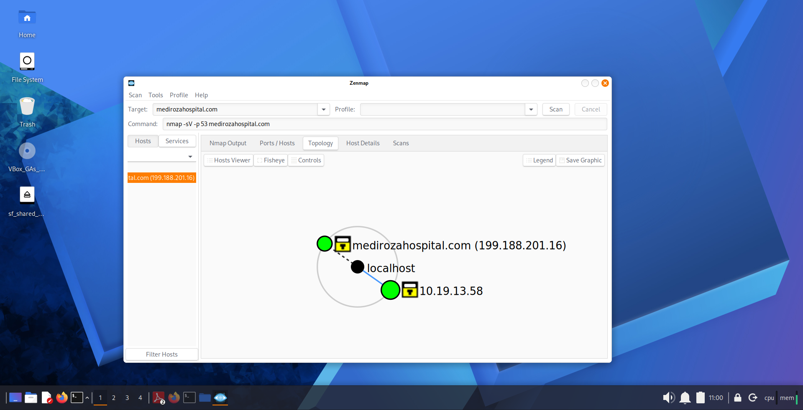 — Zenmap network topology scan of `medirozahospital.com`.
  

------
* 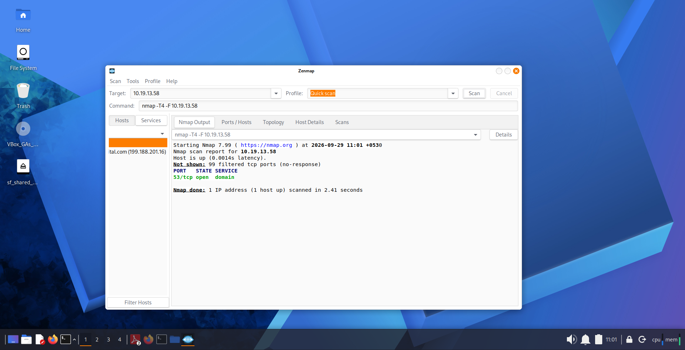 — Zenmap Nmap port scan displaying open port `53/tcp`.


----

* 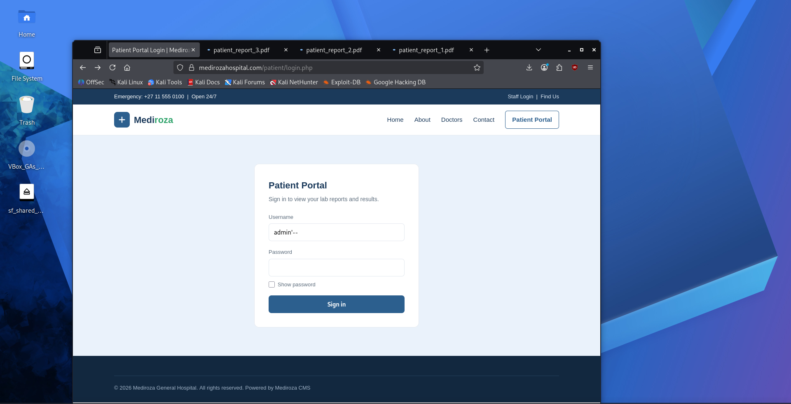 — Patient Portal login page with SQLi payload `admin'--`.

---

* 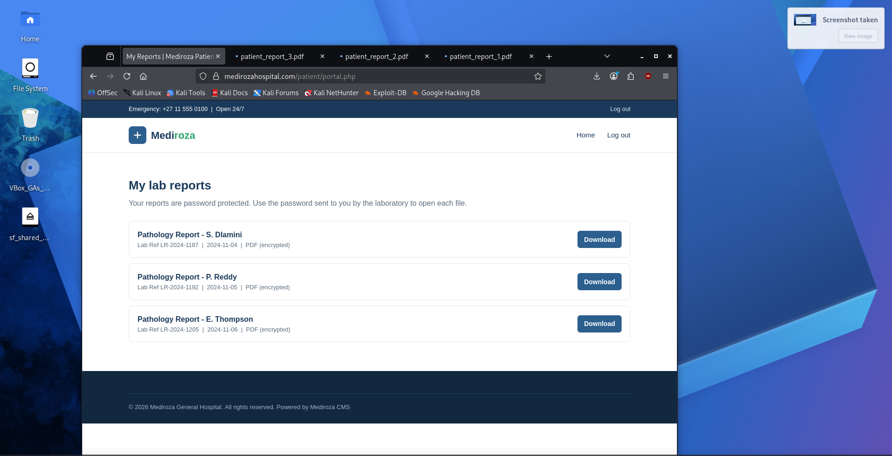 — Patient Portal dashboard with 3 protected lab PDF links.

---

* 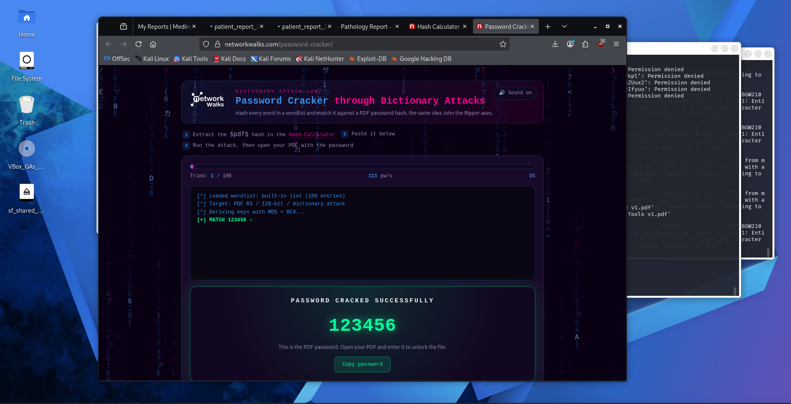 — Networkwalks Online Cracker displaying password match `123456`.

---

* 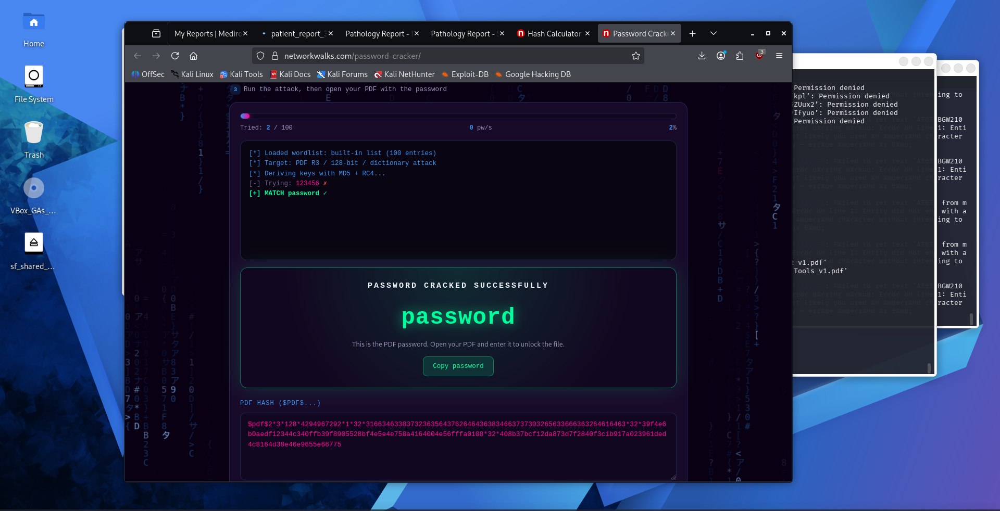 — Networkwalks Online Cracker displaying password match `password`.
---

* 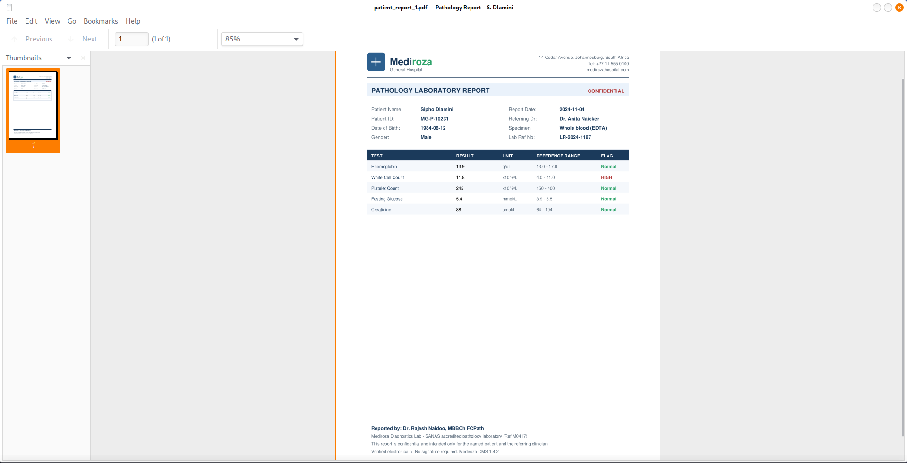 — Decrypted Pathology Report for Sipho Dlamini.
---

* 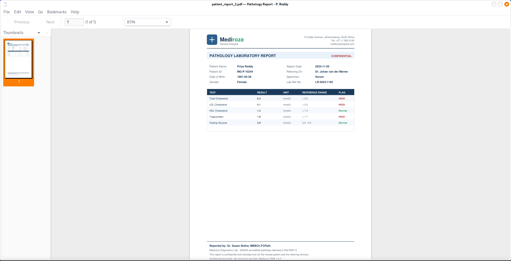 — Decrypted Pathology Report for Priya Reddy.
---

* 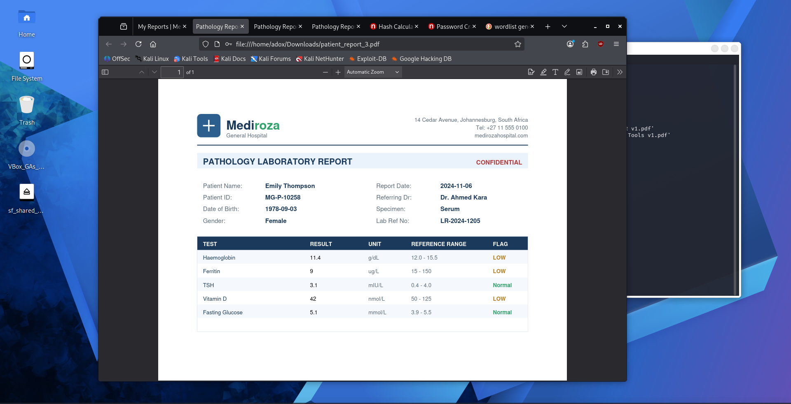 — Decrypted Pathology Report for Emily Thompson.
---

* 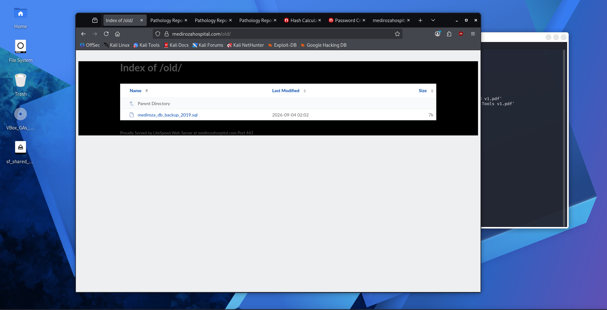 — Directory listing of `/old/` displaying `mediroza_db_backup_2019.sql`.
---

* 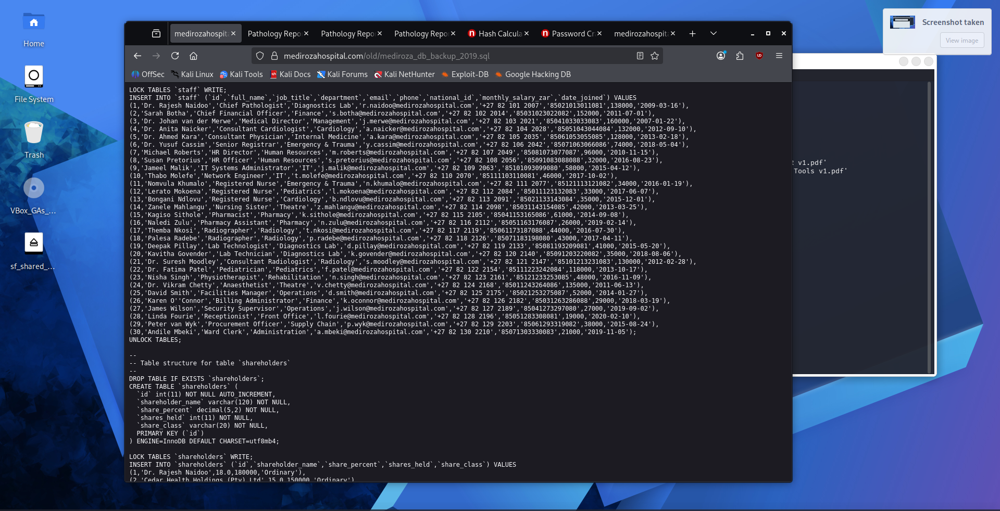 — SQL database backup revealing `staff` table salaries.
---

* 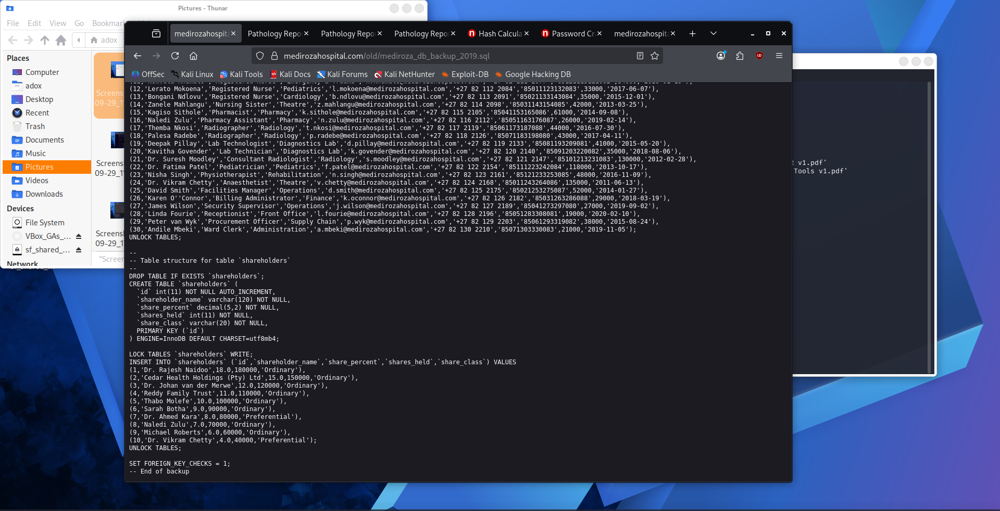 — SQL database backup revealing `shareholders` table equity details.

---

## Ethical & Authorization Notice

This project was executed as part of an authorized cybersecurity laboratory assessment under the **Networkwalks Internship Program (Batch B083)**. All testing was restricted strictly to authorized client scope (`https://medirozahospital.com`). Unauthorized application of these methods against external systems is strictly prohibited.

---

## Conclusion

The Week 4 penetration testing engagement successfully demonstrated the complete attack chain against Mediroza General Hospital. All four project milestones were accomplished, validating critical security risks in web application input handling, directory exposure, and document protection. Implementation of the provided security recommendations will effectively secure the organization against future cyber threats.
 